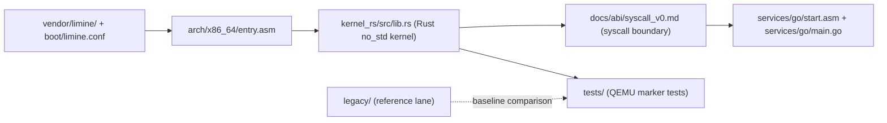
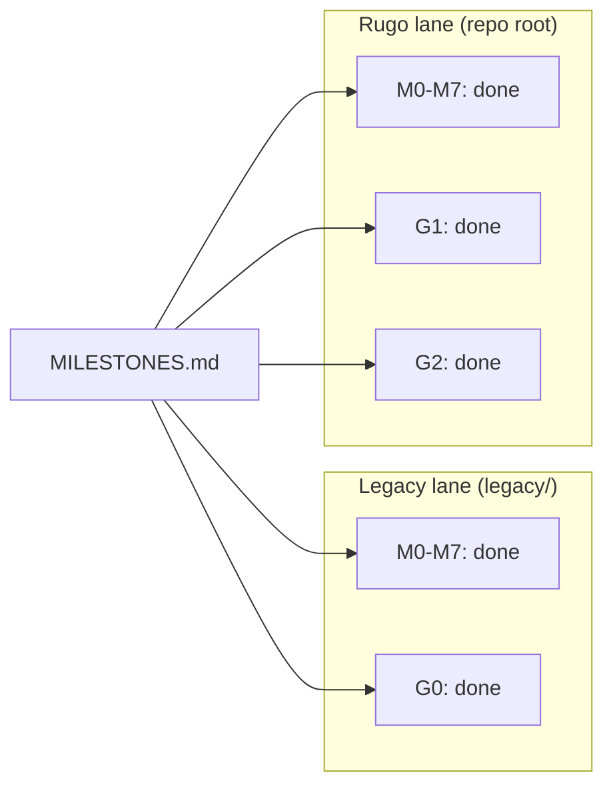
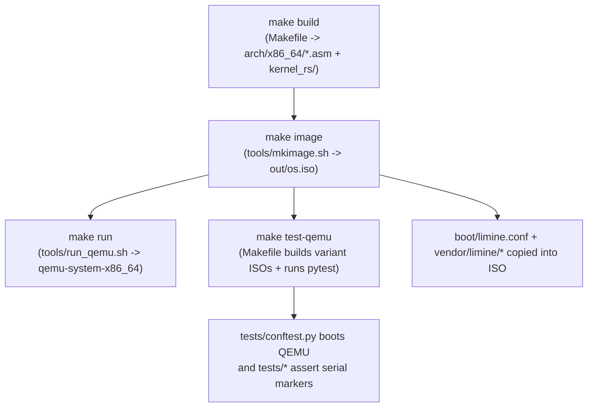

# Rugo

Rugo is a QEMU-first x86-64 hybrid OS: a `no_std` Rust kernel with Go user-space services.

- Boots through Limine and runs marker-based acceptance tests in QEMU.
- Keeps kernel mechanisms in Rust and user-space policy/services in Go (TinyGo-first).
- Preserves a full legacy C lane in `legacy/` as a working baseline.

## Quick demo

Placeholders (real captures only):

- `TODO`: add `docs/visuals/screenshots/boot-qemu.png` (QEMU boot screenshot)
- `TODO`: add `docs/visuals/screenshots/make-run-demo.gif` (10-20s capture of `make run` or `make test-qemu`)

Exact capture steps:

1. Build an image: `make image`
2. Record boot output: `make run`
3. Record test flow (optional GIF source): `make test-qemu`
4. Follow the strict media recipe in `docs/visuals/screenshots/README.md`

## Architecture

### High-level architecture



### Lane comparison (from `MILESTONES.md`)



### Boot and test flow



Diagram sources: `docs/visuals/architecture.mmd`, `docs/visuals/lanes.mmd`, `docs/visuals/boot-flow.mmd`, `docs/visuals/syscall-boundary.mmd`.

## Milestone status

Source of truth: [MILESTONES.md](MILESTONES.md)

| Lane | Kernel milestones | Go milestones |
|------|-------------------|---------------|
| Legacy (`legacy/`) | M0-M7: done | G0: done |
| Rugo (repo root) | M0-M35: done | G1: done, G2: done |

Tiny visual summary:

```text
Legacy: [M0 M1 M2 M3 M4 M5 M6 M7] [G0] complete
Rugo:   [M0 M1 M2 M3 M4 M5 M6 M7 M8 M9 M10 M11 M12 M13 M14 M15 M16 M17 M18 M19 M20 M21 M22 M23 M24 M25 M26 M27 M28 M29 M30 M31 M32 M33 M34 M35] [G1] complete  [G2] complete
```

## Post-G2 roadmap

- Research roadmap (M8-M14): [docs/POST_G2_EXTENDED_MILESTONES.md](docs/POST_G2_EXTENDED_MILESTONES.md)
- Next roadmap (M35-M39): [docs/M35_M39_GENERAL_PURPOSE_EXPANSION_ROADMAP.md](docs/M35_M39_GENERAL_PURPOSE_EXPANSION_ROADMAP.md)
- M8 execution backlog (completed): `docs/M8_EXECUTION_BACKLOG.md`
- M9 execution backlog (completed): `docs/M9_EXECUTION_BACKLOG.md`
- M10 execution backlog (completed): `docs/M10_EXECUTION_BACKLOG.md`
- M11 execution backlog (completed): `docs/M11_EXECUTION_BACKLOG.md`
- M12 execution backlog (completed): `docs/M12_EXECUTION_BACKLOG.md`
- M13 execution backlog (completed): `docs/M13_EXECUTION_BACKLOG.md`
- M14 execution backlog (completed): `docs/M14_EXECUTION_BACKLOG.md`
- M15 execution backlog (completed): `docs/M15_EXECUTION_BACKLOG.md`
- M16 execution backlog (completed): `docs/M16_EXECUTION_BACKLOG.md`
- M17 execution backlog (completed): `docs/M17_EXECUTION_BACKLOG.md`
- M18 execution backlog (completed): `docs/M18_EXECUTION_BACKLOG.md`
- M19 execution backlog (completed): `docs/M19_EXECUTION_BACKLOG.md`
- M20 execution backlog (completed): `docs/M20_EXECUTION_BACKLOG.md`
- M21 execution backlog (completed): `docs/M21_EXECUTION_BACKLOG.md`
- M22 execution backlog (completed): `docs/M22_EXECUTION_BACKLOG.md`
- M23 execution backlog (completed): `docs/M23_EXECUTION_BACKLOG.md`
- M24 execution backlog (completed): `docs/M24_EXECUTION_BACKLOG.md`
- M25 execution backlog (completed): `docs/M25_EXECUTION_BACKLOG.md`
- M26 execution backlog (completed): `docs/M26_EXECUTION_BACKLOG.md`
- M27 execution backlog (completed): `docs/M27_EXECUTION_BACKLOG.md`
- M28 execution backlog (completed): `docs/M28_EXECUTION_BACKLOG.md`
- M29 execution backlog (completed): `docs/M29_EXECUTION_BACKLOG.md`
- M30 execution backlog (completed): `docs/M30_EXECUTION_BACKLOG.md`
- M31 execution backlog (completed): `docs/M31_EXECUTION_BACKLOG.md`
- M32 execution backlog (completed): `docs/M32_EXECUTION_BACKLOG.md`
- M33 execution backlog (completed): `docs/M33_EXECUTION_BACKLOG.md`
- M34 execution backlog (completed): `docs/M34_EXECUTION_BACKLOG.md`
- M35 execution backlog (completed): `docs/M35_EXECUTION_BACKLOG.md`
- M36 execution backlog (proposed): `docs/M36_EXECUTION_BACKLOG.md`
- M37 execution backlog (proposed): `docs/M37_EXECUTION_BACKLOG.md`
- M38 execution backlog (proposed): `docs/M38_EXECUTION_BACKLOG.md`
- M39 execution backlog (proposed): `docs/M39_EXECUTION_BACKLOG.md`
- Hardware support matrix v1: [docs/hw/support_matrix_v1.md](docs/hw/support_matrix_v1.md)
- Security baseline docs: [docs/security/rights_capability_model_v1.md](docs/security/rights_capability_model_v1.md)
- Compatibility profile v1 contract: [docs/abi/compat_profile_v1.md](docs/abi/compat_profile_v1.md)
- Package/repository v1 contract: [docs/pkg/package_format_v1.md](docs/pkg/package_format_v1.md)
- Runtime/toolchain maturity docs: [docs/runtime/port_contract_v1.md](docs/runtime/port_contract_v1.md)
- Network stack maturity docs: [docs/net/network_stack_contract_v1.md](docs/net/network_stack_contract_v1.md)
- Storage reliability docs: [docs/storage/fs_v1.md](docs/storage/fs_v1.md)
- Productization/release docs: [docs/build/release_policy_v1.md](docs/build/release_policy_v1.md)

## Repo layout

| Path | Responsibility |
|------|----------------|
| `boot/` | Limine boot config and linker script (`limine.conf`, `linker.ld`) |
| `arch/x86_64/` | Assembly entry, ISR stubs, context switch |
| `kernel_rs/` | Rust `no_std` kernel crate |
| `services/` | Go user-space service artifacts (`services/go/`) |
| `legacy/` | Legacy C + gccgo reference lane |
| `tools/` | Build/image/run helpers (`mkimage.sh`, `run_qemu.sh`, `mkfs.py`) |
| `tests/` | Pytest-based QEMU acceptance tests |
| `vendor/limine/` | Vendored Limine binaries + `limine.c` used by image build |
| `docs/` | Build, ABI, networking, storage, and status docs |

## Build and test

Prerequisites: [docs/BUILD.md](docs/BUILD.md)

```bash
make build
make image
make run
make test-qemu
make test-hw-matrix
make test-security-baseline
make test-runtime-maturity
make test-process-scheduler-v2
make test-compat-v2
make test-network-stack-v2
make test-storage-reliability-v2
make test-network-stack-v1
make test-storage-reliability-v1
make test-release-engineering-v1
make test-release-ops-v2
make test-abi-stability-v3
make test-kernel-reliability-v1
make test-hw-matrix-v3
make test-firmware-attestation-v1
make test-perf-regression-v1
make test-userspace-model-v2
make test-pkg-ecosystem-v3
make test-update-trust-v1
make test-app-compat-v3
make test-security-hardening-v3
make test-vuln-response-v1
make test-observability-v2
make test-crash-dump-v1
make test-ops-ux-v3
make test-release-lifecycle-v2
make test-supply-chain-revalidation-v1
make test-conformance-v1
make test-fleet-ops-v1
make test-fleet-rollout-safety-v1
make test-maturity-qual-v1
make test-desktop-stack-v1
make test-gui-app-compat-v1

# Compatibility Profile v1 + external package bootstrap lane
python3 tools/pkg_bootstrap_v1.py --disk-out out/fs-external.img
python3 -m pytest tests/compat tests/pkg/test_pkg_external_apps.py -v
```

