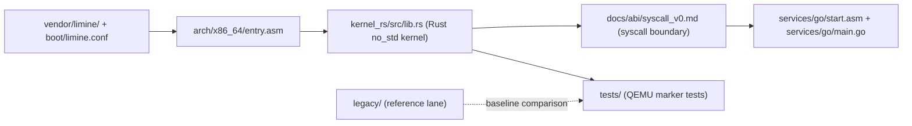
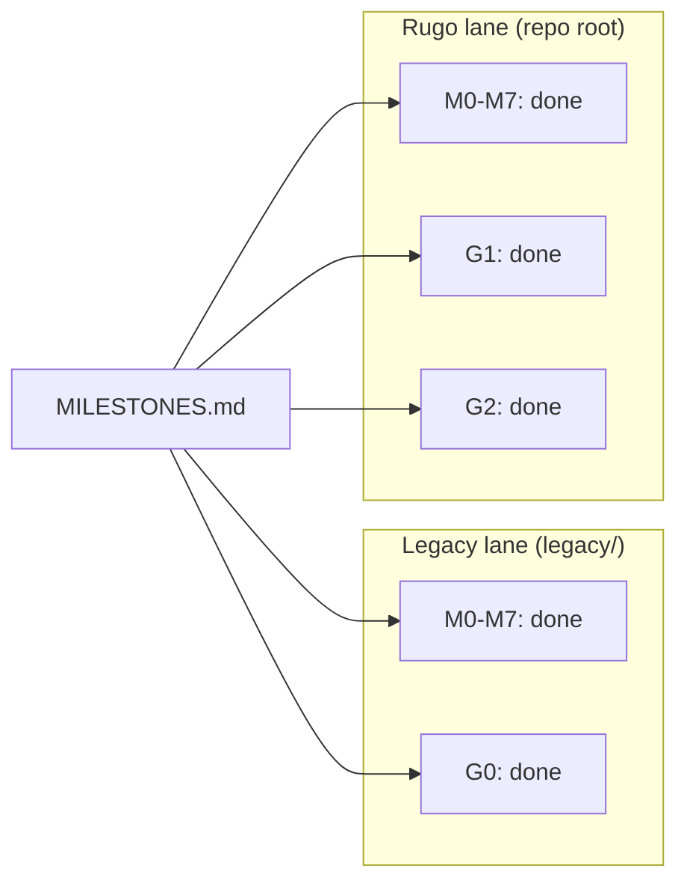
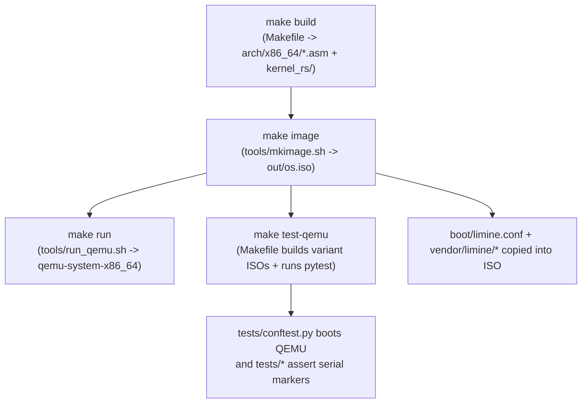

# Rugo

Rugo is a QEMU-first x86-64 hybrid OS: a `no_std` Rust kernel with Go user-space services.

- Boots through Limine and runs marker-based acceptance tests in QEMU.
- Keeps kernel mechanisms in Rust and user-space policy/services in Go (TinyGo-first).
- Preserves a full legacy C lane in `legacy/` as a working baseline.

## Quick demo

Placeholders (real captures only):

- `TODO`: add `docs/visuals/screenshots/boot-qemu.png` (QEMU boot screenshot)
- `TODO`: add `docs/visuals/screenshots/make-run-demo.gif` (10-20s capture of `make run` or `make test-qemu`)

Exact capture steps:

1. Build an image: `make image`
2. Record boot output: `make run`
3. Record test flow (optional GIF source): `make test-qemu`
4. Follow the strict media recipe in `docs/visuals/screenshots/README.md`

## Architecture

### High-level architecture



### Lane comparison (from `MILESTONES.md`)



### Boot and test flow



Diagram sources: `docs/visuals/architecture.mmd`, `docs/visuals/lanes.mmd`, `docs/visuals/boot-flow.mmd`, `docs/visuals/syscall-boundary.mmd`.

## Milestone status

Source of truth: [MILESTONES.md](MILESTONES.md)

| Lane | Kernel milestones | Go milestones |
|------|-------------------|---------------|
| Legacy (`legacy/`) | M0-M7: done | G0: done |
| Rugo (repo root) | M0-M7: done | G1: done, G2: done |

Tiny visual summary:

```text
Legacy: [M0 M1 M2 M3 M4 M5 M6 M7] [G0] complete
Rugo:   [M0 M1 M2 M3 M4 M5 M6 M7] [G1] complete  [G2] complete
```

## Repo layout

| Path | Responsibility |
|------|----------------|
| `boot/` | Limine boot config and linker script (`limine.conf`, `linker.ld`) |
| `arch/x86_64/` | Assembly entry, ISR stubs, context switch |
| `kernel_rs/` | Rust `no_std` kernel crate |
| `services/` | Go user-space service artifacts (`services/go/`) |
| `legacy/` | Legacy C + gccgo reference lane |
| `tools/` | Build/image/run helpers (`mkimage.sh`, `run_qemu.sh`, `mkfs.py`) |
| `tests/` | Pytest-based QEMU acceptance tests |
| `vendor/limine/` | Vendored Limine binaries + `limine.c` used by image build |
| `docs/` | Build, ABI, networking, storage, and status docs |

## Build and test

Prerequisites: [docs/BUILD.md](docs/BUILD.md)

```bash
make build
make image
make run
make test-qemu
```

